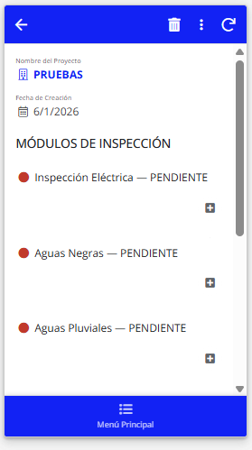
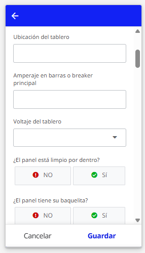
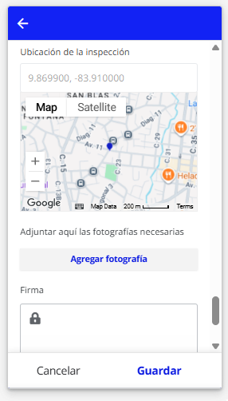
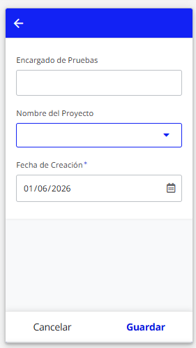
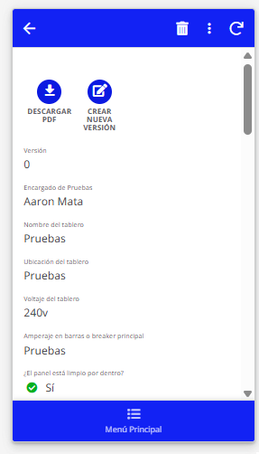
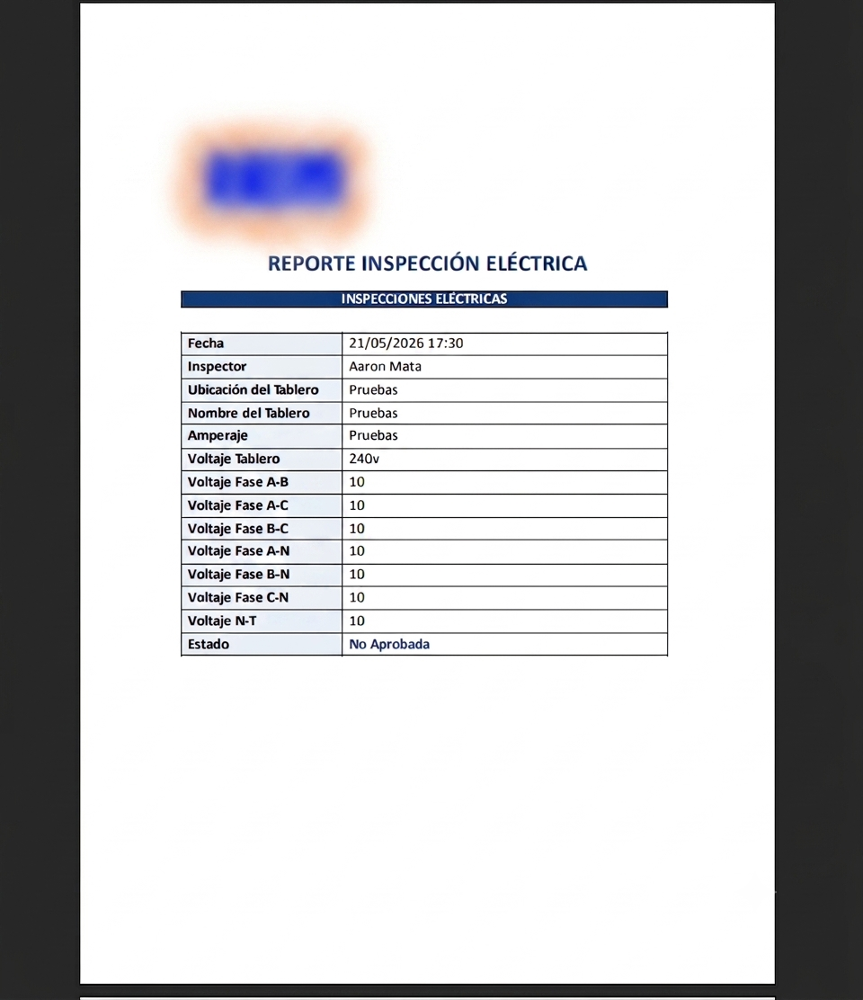
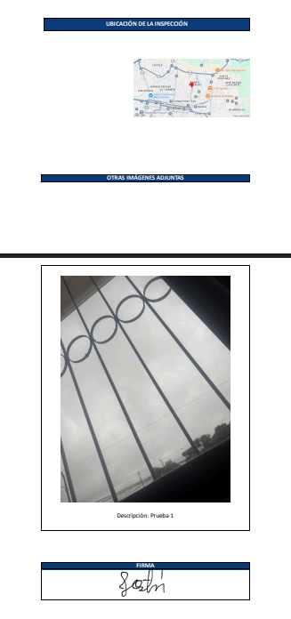

# Enterprise Inspection Management Platform

Plataforma corporativa desarrollada sobre la infraestructura de AppSheet, diseñada para la optimización, estandarización y automatización del control de inspecciones técnicas en proyectos de ingeniería civil y electromecánica. El sistema centraliza la captura de datos en campo, gestiona de forma dinámica el almacenamiento fotográfico e integra un motor automatizado para la generación de reportes en formato PDF.

---

## Módulos del Sistema

La suite está segmentada en submódulos especializados para garantizar la cobertura de todas las áreas críticas de inspección:

* **Inspección Eléctrica:** Control de tableros distribución, sistemas de cableado, lecturas de voltaje y sistemas de potencia.
* **Supresión de Incendios:** Verificación de cuartos de bombeo, redes de tuberías húmedas/secas y gabinetes de emergencia.
* **Agua Potable y Acometidas:** Monitoreo de redes de distribución primaria, presiones y puntos de acometida general.
* **Aguas Negras y Pluviales:** Supervisión de colectores sanitarios, sistemas de desfogue y redes de alcantarillado pluvial.

---

## Interfaz de la Aplicación

### Flujo de Navegación General
Control de accesos, listado de proyectos activos e índice de especialidades disponibles para el cuerpo de inspectores.

  &nbsp;&nbsp;&nbsp;&nbsp;
  &nbsp;&nbsp;&nbsp;&nbsp;
  

### Formularios de Captura de Datos (Módulo Eléctrico)
Formularios dinámicos que restringen y guían el levantamiento en campo, obligando al usuario al ingreso manual y único de descripciones fotográficas.

  &nbsp;&nbsp;&nbsp;&nbsp;
  &nbsp;&nbsp;&nbsp;&nbsp;
  

### Matriz de Control de Inspecciones
Consolidado general para la visualización del estado y progreso de los entregables y puntos de control evaluados.

  

---

## Reportes Automatizados (PDF)

Al finalizar cada auditoría en campo, el motor de automatización de la plataforma compila los datos recopilados e inicializa la generación de un reporte técnico en PDF. Mediante directivas de renderizado asíncrono, las imágenes adjuntas se incrustan dinámicamente junto con la descripción asignada por el inspector en el almacenamiento físico, impidiendo el solapamiento o truncado de texto en el documento final.

  &nbsp;&nbsp;&nbsp;&nbsp;
  

---

## Arquitectura y Características Técnicas

* **Estructuración Dinámica de Directorios:** Enrutamiento automatizado en la nube (Google Drive) segmentado por Proyecto, Especialidad Técnica y Fecha mediante la evaluación de expresiones lógicas (`CONCATENATE`, `TEXT`).
* **Saneamiento y Renombrado de Archivos:** Implementación de la Llave Primaria (`KEY`) de la entidad con reglas de validación `Valid If` personalizadas. Esto mitiga colisiones de datos en el sistema de archivos y asegura que el archivo binario (`.png`) herede de forma estricta la nomenclatura asignada en el formulario.
* **Procesamiento de Plantillas:** Integración con flujos de automatización basados en Webhooks/Bots internos para el mapeo cíclico de datos estructurados utilizando expresiones condicionales de apertura y cierre (`<<START>>` / `<<END>>`).

---
Desarrollado por **Jostin Portuguez y Aaron Mata** — 2026
